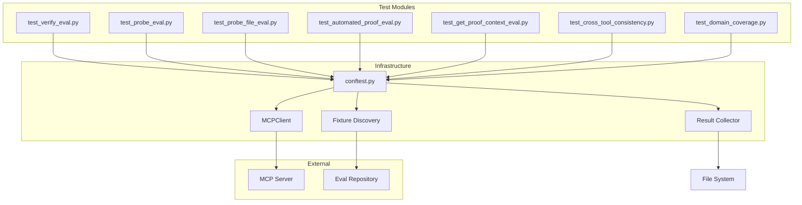

# Design Document: Evaluation Testing Framework

## Overview

The Evaluation Testing Framework is a systematic test infrastructure for validating all 6 MCP tools against 23 mathlib fixture files across 7 mathematical domains. The framework follows hexagonal architecture principles, separating test infrastructure concerns from MCP client communication, and provides tiered execution capabilities for different development workflows.

### Key Design Principles

1. **Hexagonal Architecture**: Core test logic is independent of MCP server communication details
2. **Dependency Injection**: All components receive dependencies through constructor injection
3. **Cross-Platform Compatibility**: All path operations use `pathlib.Path` for Windows/Linux support
4. **Explicit Error Handling**: All operations return Result types or raise descriptive exceptions
5. **Tiered Execution**: Tests are organized into 5 tiers (smoke, quick, normal, full, deep) using pytest markers

### Architecture Diagram



## Architecture

### Component Organization

The framework is organized into four layers:

1. **Test Layer**: Per-tool test modules that define test cases
2. **Infrastructure Layer**: Reusable components (MCPClient, FixtureDiscovery, ResultCollector)
3. **Fixture Layer**: Pytest fixtures that wire components together (conftest.py)
4. **Execution Layer**: Shell scripts that orchestrate test execution with tier selection

### Directory Structure

```
tests/lean-proof-auto-mcp-eval_tests/
├── __init__.py
├── conftest.py                          # Pytest fixtures and configuration
├── README.md                            # Documentation
├── mcp_client.py                        # Reusable MCP client
├── fixtures.py                          # Fixture discovery
├── result_collector.py                  # Result collection and persistence
├── test_verify_eval.py                  # Verify tool tests (23 tests)
├── test_probe_eval.py                   # Probe tool tests (~200-500 tests)
├── test_probe_file_eval.py              # Probe file tool tests (69 tests)
├── test_search_automated_proof_eval.py  # Search automated proof tests
├── test_try_automated_proof_eval.py     # Try automated proof tests
├── test_get_proof_context_eval.py       # Context tool tests
├── test_cross_tool_consistency.py       # Cross-tool validation
├── test_domain_coverage.py              # Domain coverage reporting
├── run_eval.sh                          # Linux/macOS execution script
└── run_eval.bat                         # Windows execution script
```

## Components and Interfaces

### 1. Path Resolution (fixtures.py)

**Purpose**: Provide cross-platform path resolution for the eval repository.

**Interface**:
```python
def get_eval_repo_path() -> Path:
    """
    Resolve the eval repository path with cross-platform support.

    Resolution order:
    1. LEAN_EVAL_REPO environment variable (if set)
    2. Platform-specific default:
       - Linux: /home/paul_d/Sources/lean-proof-auto-mcp-eval/
       - Windows: C:\Dev\lean-proof-auto-mcp-eval

    Returns:
        Path: Resolved eval repository path

    Raises:
        FileNotFoundError: If resolved path does not exist
    """
```

**Implementation Strategy**:
- Use `os.environ.get("LEAN_EVAL_REPO")` to check for override
- Use `platform.system()` to detect OS ("Linux", "Windows", "Darwin")
- Use `pathlib.Path` for all path construction
- Validate path exists before returning

### 2. Fixture Discovery (fixtures.py)

**Purpose**: Enumerate all fixture files and extract metadata.

**Data Model**:
```python
@dataclass(frozen=True)
class FixtureFile:
    """Represents a discovered fixture file."""
    path: Path                    # Absolute path to .lean file
    domain: str                   # Mathematical domain (e.g., "Algebra")
    subdomain: str                # Subdomain (e.g., "Group")
    relative_path: str            # Path relative to fixtures/ directory
```

**Interface**:
```python
def discover_fixtures(eval_repo_path: Path) -> list[FixtureFile]:
    """
    Discover all fixture files in the eval repository.

    Args:
        eval_repo_path: Path to eval repository root

    Returns:
        List of FixtureFile objects, one per discovered .lean file

    Raises:
        FileNotFoundError: If fixtures directory does not exist
    """

# Module-level constant for parametrization
ALL_FIXTURE_FILES: list[FixtureFile] = discover_fixtures(get_eval_repo_path())
```

**Implementation Strategy**:
- Search `{eval_repo_path}/fixtures/mathlib/Fixtures/**/*.lean` recursively
- Extract domain from first directory level (e.g., `Algebra/`)
- Extract subdomain from second directory level (e.g., `Group/`)
- Compute relative path from `Fixtures/` directory
- Return immutable FixtureFile objects

### 3. MCP Client (mcp_client.py)

**Purpose**: Provide reusable MCP server communication with context manager support.

**Interface**:
```python
class MCPClient:
    """Reusable MCP client with context manager support."""

    def __init__(self, server_path: Path, working_dir: Path, timeout: float = 30.0):
        """
        Initialize MCP client.

        Args:
            server_path: Path to MCP server.py script
            working_dir: Working directory for server process (eval repo root)
            timeout: Timeout in seconds for tool calls
        """

    def __enter__(self) -> "MCPClient":
        """Start the MCP server process."""

    def __exit__(self, exc_type, exc_val, exc_tb) -> None:
        """Terminate the MCP server process."""

    def call_tool(self, name: str, arguments: dict[str, Any]) -> dict[str, Any]:
        """
        Call an MCP tool and return the result.

        Args:
            name: Tool name (e.g., "verify", "probe")
            arguments: Tool arguments as dictionary

        Returns:
            JSON-RPC response as dictionary

        Raises:
            TimeoutError: If tool call exceeds timeout
            ValueError: If server returns malformed JSON
            RuntimeError: If server process has terminated
        """

    def health_check(self) -> bool:
        """
        Check if server is responsive.

        Returns:
            True if server responds to ping, False otherwise
        """

    def restart(self) -> None:
        """Terminate and restart the server process."""
```

**Implementation Strategy**:
- Use `subprocess.Popen` with `uv run python {server_path}` command
- Set `stdin=PIPE`, `stdout=PIPE`, `stderr=PIPE`, `text=True`
- Set `cwd=working_dir` to ensure server operates in eval repo context
- In `call_tool`, construct JSON-RPC request with sequential ID
- Write request to stdin with newline, flush immediately
- Read response from stdout with timeout using `select` or `threading.Timer`
- Parse JSON response and validate structure
- In `__exit__`, call `process.terminate()` then `process.wait(timeout=5)`
- If process doesn't terminate, call `process.kill()`

**Error Handling**:
- Timeout: Raise `TimeoutError` with descriptive message
- Malformed JSON: Raise `ValueError` with raw response
- Dead process: Raise `RuntimeError` with stderr output

### 4. Result Collection (result_collector.py)

**Purpose**: Record, persist, and analyze test results.

**Data Model**:
```python
@dataclass(frozen=True)
class ToolResult:
    """Represents the result of a single tool invocation."""
    tool: str                     # Tool name (e.g., "verify")
    file_path: str                # Fixture file path
    theorem_id: str | None        # Theorem name (None for file-level tools)
    mode: str | None              # Mode (aesop/grind/both, None if not applicable)
    status: str                   # "success", "failure", "timeout", "error"
    elapsed_ms: float             # Execution time in milliseconds
    raw_response: dict[str, Any]  # Full JSON-RPC response
    timestamp: str                # ISO 8601 timestamp
    domain: str                   # Mathematical domain
    subdomain: str                # Mathematical subdomain
```

**Interface**:
```python
class ResultCollector:
    """Collects and persists test results."""

    def __init__(self):
        """Initialize result collector with empty results list."""

    def record(
        self,
        tool: str,
        file_path: str,
        status: str,
        elapsed_ms: float,
        raw_response: dict[str, Any],
        domain: str,
        subdomain: str,
        theorem_id: str | None = None,
        mode: str | None = None,
    ) -> None:
        """
        Record a tool invocation result.

        Args:
            tool: Tool name
            file_path: Path to fixture file
            status: Result status
            elapsed_ms: Execution time in milliseconds
            raw_response: Full JSON-RPC response
            domain: Mathematical domain
            subdomain: Mathematical subdomain
            theorem_id: Theorem name (optional)
            mode: Execution mode (optional)
        """

    def save(self, output_dir: Path) -> None:
        """
        Save results to JSON files.

        Args:
            output_dir: Directory to save results

        Creates:
            - {output_dir}/results.json: All results
            - {output_dir}/summary.json: Aggregated summary
            - {output_dir}/metadata.json: Execution metadata
        """

    def summary(self) -> dict[str, Any]:
        """
        Generate summary statistics.

        Returns:
            Dictionary with aggregations:
            - by_tool: Results grouped by tool
            - by_domain: Results grouped by domain
            - by_status: Results grouped by status
            - total_count: Total number of results
            - total_elapsed_ms: Total execution time
        """

    def compare_baseline(self, baseline_path: Path) -> dict[str, Any]:
        """
        Compare current results against a baseline.

        Args:
            baseline_path: Path to baseline results.json

        Returns:
            Dictionary with:
            - regressions: Tests that changed from success to failure
            - improvements: Tests that changed from failure to success
            - unchanged: Tests with same status
        """
```

**Implementation Strategy**:
- Store results in a list of ToolResult objects
- In `record`, create ToolResult with `datetime.now().isoformat()` timestamp
- In `save`, serialize results to JSON with custom encoder for datetime
- In `summary`, use collections.Counter and groupby for aggregations
- In `compare_baseline`, load baseline JSON and compare by (tool, file, theorem, mode) key

### 5. Pytest Configuration (conftest.py)

**Purpose**: Provide fixtures that wire components together.

**Fixtures**:

```python
@pytest.fixture(scope="session")
def eval_repo() -> Path:
    """Session-scoped fixture providing eval repository path."""
    path = get_eval_repo_path()
    if not path.exists():
        pytest.skip(f"Eval repository not found at {path}")
    return path

@pytest.fixture(scope="session")
def mcp_server_path() -> Path:
    """Session-scoped fixture providing MCP server path."""
    # Compute path relative to this file
    return Path(__file__).parent.parent.parent / "src" / "lean_proof_auto_mcp" / "server.py"

@pytest.fixture(scope="session")
def result_collector() -> ResultCollector:
    """Session-scoped fixture providing result collector."""
    return ResultCollector()

@pytest.fixture(scope="module")
def mcp_client(eval_repo: Path, mcp_server_path: Path) -> Iterator[MCPClient]:
    """Module-scoped fixture providing MCP client."""
    with MCPClient(mcp_server_path, eval_repo) as client:
        yield client

@pytest.fixture(params=ALL_FIXTURE_FILES, ids=lambda f: f.relative_path)
def fixture_file(request) -> FixtureFile:
    """Parametrized fixture yielding each fixture file."""
    return request.param
```

**Markers**:
```python
def pytest_configure(config):
    """Register custom markers."""
    # Tier markers
    config.addinivalue_line("markers", "eval_smoke: Smoke tier (~2 min)")
    config.addinivalue_line("markers", "eval_quick: Quick tier (~10 min)")
    config.addinivalue_line("markers", "eval_normal: Normal tier (~30 min)")
    config.addinivalue_line("markers", "eval_full: Full tier (~2 hours)")
    config.addinivalue_line("markers", "eval_deep: Deep tier (all tests)")

    # Domain markers
    config.addinivalue_line("markers", "eval_algebra: Algebra domain")
    config.addinivalue_line("markers", "eval_analysis: Analysis domain")
    config.addinivalue_line("markers", "eval_data: Data domain")
    config.addinivalue_line("markers", "eval_group_theory: Group theory domain")
    config.addinivalue_line("markers", "eval_linear_algebra: Linear algebra domain")
    config.addinivalue_line("markers", "eval_ring_theory: Ring theory domain")
    config.addinivalue_line("markers", "eval_topology: Topology domain")
```

### 6. Test Module Structure

Each per-tool test module follows this pattern:

```python
"""Tests for {tool_name} tool evaluation."""

import pytest
import time
from pathlib import Path

pytestmark = [pytest.mark.eval_normal]  # Default tier

class Test{ToolName}:
    """Test {tool_name} tool on fixture files."""

    @pytest.mark.eval_smoke
    @pytest.mark.parametrize("fixture_file", SMOKE_FIXTURES, indirect=False)
    def test_{tool_name}_smoke(
        self,
        mcp_client: MCPClient,
        fixture_file: FixtureFile,
        result_collector: ResultCollector,
    ):
        """Smoke test for {tool_name} tool."""
        start = time.perf_counter()

        try:
            response = mcp_client.call_tool(
                "{tool_name}",
                {"file_path": str(fixture_file.path), ...}
            )
            elapsed_ms = (time.perf_counter() - start) * 1000
            status = "success" if "result" in response else "failure"
        except Exception as e:
            elapsed_ms = (time.perf_counter() - start) * 1000
            status = "error"
            response = {"error": str(e)}

        result_collector.record(
            tool="{tool_name}",
            file_path=str(fixture_file.path),
            status=status,
            elapsed_ms=elapsed_ms,
            raw_response=response,
            domain=fixture_file.domain,
            subdomain=fixture_file.subdomain,
        )

        # Assertions
        assert status in ["success", "failure", "error"]
```

### 7. Execution Scripts

**run_eval.sh (Linux/macOS)**:
```bash
#!/bin/bash
set -e

TIER=${1:-normal}
TIMESTAMP=$(date +%Y%m%d-%H%M%S)
REPORT_DIR="reports/eval-${TIMESTAMP}-${TIER}"

mkdir -p "$REPORT_DIR"

case "$TIER" in
    smoke)
        MARKERS="-m eval_smoke"
        ;;
    quick)
        MARKERS="-m 'eval_smoke or eval_quick'"
        ;;
    normal)
        MARKERS="-m 'eval_smoke or eval_quick or eval_normal'"
        ;;
    full)
        MARKERS="-m 'eval_smoke or eval_quick or eval_normal or eval_full'"
        ;;
    deep)
        MARKERS=""
        ;;
    *)
        echo "Unknown tier: $TIER"
        echo "Valid tiers: smoke, quick, normal, full, deep"
        exit 1
        ;;
esac

echo "Running evaluation tests: tier=$TIER"
echo "Results will be saved to: $REPORT_DIR"

pytest tests/lean-proof-auto-mcp-eval_tests/ \
    $MARKERS \
    -v \
    --tb=short \
    --junit-xml="$REPORT_DIR/junit.xml"

echo "Evaluation complete. Results saved to: $REPORT_DIR"
```

**run_eval.bat (Windows)**:
```batch
@echo off
setlocal enabledelayedexpansion

set TIER=%1
if "%TIER%"=="" set TIER=normal

for /f "tokens=1-4 delims=/ " %%a in ('date /t') do (set MYDATE=%%c%%a%%b)
for /f "tokens=1-2 delims=: " %%a in ('time /t') do (set MYTIME=%%a%%b)
set TIMESTAMP=%MYDATE%-%MYTIME%
set REPORT_DIR=reports\eval-%TIMESTAMP%-%TIER%

mkdir "%REPORT_DIR%" 2>nul

if "%TIER%"=="smoke" (
    set MARKERS=-m eval_smoke
) else if "%TIER%"=="quick" (
    set MARKERS=-m "eval_smoke or eval_quick"
) else if "%TIER%"=="normal" (
    set MARKERS=-m "eval_smoke or eval_quick or eval_normal"
) else if "%TIER%"=="full" (
    set MARKERS=-m "eval_smoke or eval_quick or eval_normal or eval_full"
) else if "%TIER%"=="deep" (
    set MARKERS=
) else (
    echo Unknown tier: %TIER%
    echo Valid tiers: smoke, quick, normal, full, deep
    exit /b 1
)

echo Running evaluation tests: tier=%TIER%
echo Results will be saved to: %REPORT_DIR%

pytest tests\lean-proof-auto-mcp-eval_tests\ ^
    %MARKERS% ^
    -v ^
    --tb=short ^
    --junit-xml="%REPORT_DIR%\junit.xml"

echo Evaluation complete. Results saved to: %REPORT_DIR%
```

## Data Models

### FixtureFile
```python
@dataclass(frozen=True)
class FixtureFile:
    path: Path           # Absolute path to .lean file
    domain: str          # e.g., "Algebra"
    subdomain: str       # e.g., "Group"
    relative_path: str   # e.g., "Algebra/Group/Subgroup/Basic.lean"
```

### ToolResult
```python
@dataclass(frozen=True)
class ToolResult:
    tool: str                     # Tool name
    file_path: str                # Fixture file path
    theorem_id: str | None        # Theorem name (None for file-level)
    mode: str | None              # aesop/grind/both (None if N/A)
    status: str                   # success/failure/timeout/error
    elapsed_ms: float             # Execution time
    raw_response: dict[str, Any]  # Full JSON-RPC response
    timestamp: str                # ISO 8601 timestamp
    domain: str                   # Mathematical domain
    subdomain: str                # Mathematical subdomain
```

### Summary Statistics
```python
{
    "by_tool": {
        "verify": {"success": 20, "failure": 3, "total": 23},
        "probe": {"success": 450, "failure": 50, "total": 500},
        ...
    },
    "by_domain": {
        "Algebra": {"success": 100, "failure": 10, "total": 110},
        ...
    },
    "by_status": {
        "success": 800,
        "failure": 100,
        "timeout": 5,
        "error": 10
    },
    "total_count": 915,
    "total_elapsed_ms": 1800000.0
}
```


## Correctness Properties

This section defines executable correctness properties that the evaluation testing framework must satisfy. These properties will be validated using property-based testing where applicable, and through unit tests for deterministic behaviors.

### Property 1: Path Resolution Consistency

**Validates: Requirements 1.1, 1.2, 1.3, 1.4**

**Property Statement**: For any platform (Linux, Windows, Darwin), `get_eval_repo_path()` returns a valid Path object that either matches the `LEAN_EVAL_REPO` environment variable (if set) or the platform-specific default.

**Formal Specification**:
```
∀ platform ∈ {Linux, Windows, Darwin}, env_var ∈ {None, ValidPath}:
  path = get_eval_repo_path()
  ⟹ (env_var ≠ None ⟹ path == Path(env_var))
  ∧ (env_var == None ∧ platform == Linux ⟹ path == Path("/home/paul_d/Sources/lean-proof-auto-mcp-eval/"))
  ∧ (env_var == None ∧ platform == Windows ⟹ path == Path("C:/Dev/lean-proof-auto-mcp-eval"))
  ∧ isinstance(path, Path)
```

**Test Strategy**: Use parametrized tests with mocked `platform.system()` and `os.environ` to verify all combinations.

### Property 2: MCP Client Lifecycle Integrity

**Validates: Requirements 2.1, 2.2, 2.3**

**Property Statement**: For any MCPClient instance used as a context manager, the server process is started on entry and terminated on exit, regardless of whether exceptions occur within the context.

**Formal Specification**:
```
∀ client: MCPClient, operation: Callable:
  with client as c:
    process_started = (c.process is not None ∧ c.process.poll() is None)
    operation(c)  # May raise exception
  ⟹ process_started
  ∧ (c.process.poll() is not None)  # Process terminated
```

**Test Strategy**: Create MCPClient instances with mock subprocess, verify `__enter__` starts process and `__exit__` terminates it, including exception scenarios.

### Property 3: Tool Call Timeout Enforcement

**Validates: Requirements 2.5**

**Property Statement**: For any tool call with timeout T seconds, if the server does not respond within T seconds, the client raises a TimeoutError.

**Formal Specification**:
```
∀ client: MCPClient, tool: str, args: dict, timeout: float:
  start_time = time.now()
  try:
    result = client.call_tool(tool, args, timeout=timeout)
    elapsed = time.now() - start_time
    ⟹ elapsed ≤ timeout
  except TimeoutError:
    elapsed = time.now() - start_time
    ⟹ elapsed ≥ timeout
```

**Test Strategy**: Use mock server that delays responses, verify TimeoutError is raised after timeout period.

### Property 4: Fixture Discovery Completeness

**Validates: Requirements 3.1, 3.7**

**Property Statement**: For a valid eval repository with N fixture files, `discover_fixtures()` returns exactly N FixtureFile objects, one per `.lean` file.

**Formal Specification**:
```
∀ eval_repo: Path where eval_repo.exists():
  lean_files = {f for f in eval_repo.rglob("fixtures/mathlib/Fixtures/**/*.lean")}
  discovered = discover_fixtures(eval_repo)
  ⟹ len(discovered) == len(lean_files)
  ∧ ∀ fixture ∈ discovered: fixture.path ∈ lean_files
  ∧ ∀ lean_file ∈ lean_files: ∃ fixture ∈ discovered: fixture.path == lean_file
```

**Test Strategy**: Create temporary directory structure with known number of `.lean` files, verify discovery finds all and only those files.

### Property 5: Fixture Metadata Extraction Correctness

**Validates: Requirements 3.2, 3.3, 3.4**

**Property Statement**: For any discovered fixture file with path `Fixtures/Domain/Subdomain/File.lean`, the FixtureFile object correctly extracts domain and subdomain from the path structure.

**Formal Specification**:
```
∀ fixture: FixtureFile:
  path_parts = fixture.relative_path.split('/')
  ⟹ fixture.domain == path_parts[0]
  ∧ fixture.subdomain == path_parts[1]
  ∧ fixture.relative_path.startswith(f"{fixture.domain}/{fixture.subdomain}/")
```

**Test Strategy**: Use property-based testing to generate various path structures and verify extraction logic.

### Property 6: Result Recording Idempotency

**Validates: Requirements 4.1, 4.2**

**Property Statement**: Recording the same result multiple times produces multiple distinct ToolResult entries with different timestamps.

**Formal Specification**:
```
∀ collector: ResultCollector, tool: str, file: str, status: str:
  collector.record(tool, file, status, ...)
  count1 = len(collector.results)
  collector.record(tool, file, status, ...)
  count2 = len(collector.results)
  ⟹ count2 == count1 + 1
  ∧ collector.results[-1].timestamp ≠ collector.results[-2].timestamp
```

**Test Strategy**: Record same result twice with small delay, verify both are stored with different timestamps.

### Property 7: Result Persistence Completeness

**Validates: Requirements 4.3, 4.4**

**Property Statement**: For any ResultCollector with N recorded results, calling `save(output_dir)` creates files containing all N results in valid JSON format.

**Formal Specification**:
```
∀ collector: ResultCollector, output_dir: Path:
  n = len(collector.results)
  collector.save(output_dir)
  ⟹ (output_dir / "results.json").exists()
  ∧ (output_dir / "summary.json").exists()
  ∧ (output_dir / "metadata.json").exists()
  ∧ len(json.load(output_dir / "results.json")) == n
```

**Test Strategy**: Record various numbers of results, save to temp directory, verify all files exist and contain correct data.

### Property 8: Summary Aggregation Correctness

**Validates: Requirements 4.5**

**Property Statement**: For any ResultCollector, the summary aggregations correctly count results by tool, domain, and status.

**Formal Specification**:
```
∀ collector: ResultCollector:
  summary = collector.summary()
  ⟹ sum(summary["by_tool"][tool]["total"] for tool in summary["by_tool"]) == summary["total_count"]
  ∧ sum(summary["by_domain"][domain]["total"] for domain in summary["by_domain"]) == summary["total_count"]
  ∧ sum(summary["by_status"][status] for status in summary["by_status"]) == summary["total_count"]
```

**Test Strategy**: Record results with known distributions, verify summary counts match expected values.

### Property 9: Baseline Comparison Accuracy

**Validates: Requirements 4.6, 4.7**

**Property Statement**: For any two result sets A (baseline) and B (current), `compare_baseline()` correctly identifies regressions (success→failure), improvements (failure→success), and unchanged results.

**Formal Specification**:
```
∀ baseline: list[ToolResult], current: list[ToolResult]:
  comparison = compare_baseline(baseline, current)
  ⟹ ∀ result ∈ comparison["regressions"]:
       ∃ b ∈ baseline, c ∈ current:
         same_test(b, c) ∧ b.status == "success" ∧ c.status == "failure"
  ∧ ∀ result ∈ comparison["improvements"]:
       ∃ b ∈ baseline, c ∈ current:
         same_test(b, c) ∧ b.status == "failure" ∧ c.status == "success"
  ∧ len(comparison["regressions"]) + len(comparison["improvements"]) + len(comparison["unchanged"]) == len(baseline)
```

**Test Strategy**: Create baseline and current result sets with known differences, verify comparison correctly categorizes each result.

### Property 10: Fixture Parametrization Completeness

**Validates: Requirements 5.5**

**Property Statement**: The parametrized `fixture_file` fixture yields exactly one test case per discovered fixture file.

**Formal Specification**:
```
∀ test_function using fixture_file:
  test_cases = pytest.collect(test_function)
  ⟹ len(test_cases) == len(ALL_FIXTURE_FILES)
  ∧ ∀ fixture ∈ ALL_FIXTURE_FILES: ∃ test_case ∈ test_cases: test_case.param == fixture
```

**Test Strategy**: Use pytest collection API to verify parametrization generates correct number of test cases.

### Property 11: Tier Marker Hierarchy

**Validates: Requirements 13.3, 13.4, 13.5, 13.6, 13.7**

**Property Statement**: Tests marked with tier T are included in all tier executions ≥ T, where smoke < quick < normal < full < deep.

**Formal Specification**:
```
∀ test: TestCase, tier_test: str, tier_run: str:
  tier_order = ["smoke", "quick", "normal", "full", "deep"]
  test has marker tier_test
  ∧ tier_order.index(tier_run) ≥ tier_order.index(tier_test)
  ⟹ test is executed in tier_run
```

**Test Strategy**: Mark tests with various tiers, run each tier level, verify correct tests are executed.

### Property 12: Execution Time Bounds

**Validates: Requirements 13.3, 13.4, 13.5, 13.6**

**Property Statement**: For tiers with time constraints (smoke, quick, normal, full), execution completes within the specified time limit.

**Formal Specification**:
```
∀ tier ∈ {smoke, quick, normal, full}:
  time_limits = {"smoke": 120, "quick": 600, "normal": 1800, "full": 7200}  # seconds
  start = time.now()
  run_tier(tier)
  elapsed = time.now() - start
  ⟹ elapsed ≤ time_limits[tier]
```

**Test Strategy**: Run each tier and measure execution time, verify it completes within bounds (may require test environment optimization).

### Property 13: Result Directory Isolation

**Validates: Requirements 14.2**

**Property Statement**: Each test run creates a unique timestamped directory, ensuring no conflicts between concurrent or sequential runs.

**Formal Specification**:
```
∀ run1, run2: TestRun where run1 ≠ run2:
  dir1 = run1.result_directory
  dir2 = run2.result_directory
  ⟹ dir1 ≠ dir2
  ∧ dir1.name matches "eval-YYYYMMDD-HHMMSS-{tier}"
  ∧ dir2.name matches "eval-YYYYMMDD-HHMMSS-{tier}"
```

**Test Strategy**: Run tests multiple times in quick succession, verify each creates a unique directory.

### Property 14: Cross-Tool Theorem Consistency

**Validates: Requirements 11.1, 11.2**

**Property Statement**: For any fixture file F, if tool A reports theorem T exists in F, then tool B must also report T exists in F (or report an error).

**Formal Specification**:
```
∀ file: FixtureFile, theorem: str:
  probe_result = probe(file, theorem)
  verify_result = verify(file, theorem)
  ⟹ (probe_result.status == "success" ∧ theorem ∈ probe_result.theorems)
     ⟹ (verify_result.status == "success" ∨ verify_result.status == "error")
```

**Test Strategy**: Run probe and verify on same files, verify they agree on theorem existence.

### Property 15: Domain Coverage Completeness

**Validates: Requirements 12.1, 12.2**

**Property Statement**: For any test run covering all fixture files, the domain coverage report includes all 7 mathematical domains.

**Formal Specification**:
```
∀ test_run: TestRun where all fixtures tested:
  coverage = generate_domain_coverage(test_run.results)
  expected_domains = {"Algebra", "Analysis", "Data", "GroupTheory", "LinearAlgebra", "RingTheory", "Topology"}
  ⟹ set(coverage.keys()) == expected_domains
  ∧ ∀ domain ∈ expected_domains: coverage[domain]["total"] > 0
```

**Test Strategy**: Run full test suite, verify coverage report includes all domains with non-zero counts.

### Property 16: Test Isolation from Source Code

**Validates: Requirements 16.1, 16.2, 16.3**

**Property Statement**: The evaluation framework does not modify any files outside `tests/lean-proof-auto-mcp-eval_tests/` and `reports/`.

**Formal Specification**:
```
∀ test_run: TestRun:
  files_before = snapshot_filesystem(exclude=["tests/lean-proof-auto-mcp-eval_tests/", "reports/"])
  run_evaluation_tests()
  files_after = snapshot_filesystem(exclude=["tests/lean-proof-auto-mcp-eval_tests/", "reports/"])
  ⟹ files_before == files_after
```

**Test Strategy**: Take filesystem snapshot before and after test run, verify no changes outside allowed directories.

## Testing Framework

### Unit Tests

Unit tests will validate individual components in isolation:

- **test_path_resolution.py**: Validate `get_eval_repo_path()` with mocked platform and environment
- **test_fixture_discovery.py**: Validate `discover_fixtures()` with temporary directory structures
- **test_mcp_client.py**: Validate MCPClient lifecycle with mocked subprocess
- **test_result_collector.py**: Validate ResultCollector recording, persistence, and aggregation

### Integration Tests

Integration tests will validate component interactions:

- **test_conftest_fixtures.py**: Validate pytest fixtures wire components correctly
- **test_tier_execution.py**: Validate tier markers filter tests correctly
- **test_end_to_end.py**: Validate complete test run produces expected outputs

### Property-Based Tests

Property-based tests will validate universal properties:

- **test_properties_path_resolution.py**: Property 1 (path resolution consistency)
- **test_properties_fixture_discovery.py**: Properties 4, 5 (fixture discovery and metadata)
- **test_properties_result_collector.py**: Properties 6, 7, 8, 9 (result recording and aggregation)
- **test_properties_tier_hierarchy.py**: Property 11 (tier marker hierarchy)

### Acceptance Tests

Acceptance tests will validate end-to-end workflows:

- **test_smoke_tier_acceptance.py**: Run smoke tier, verify completes in < 2 minutes
- **test_quick_tier_acceptance.py**: Run quick tier, verify completes in < 10 minutes
- **test_cross_platform_acceptance.py**: Verify framework works on both Linux and Windows

## Implementation Notes

### Testing Framework Selection

- **pytest**: Primary test framework for all test types
- **hypothesis**: Property-based testing library for generating test inputs
- **pytest-timeout**: Enforce time limits on test execution
- **pytest-xdist**: Enable parallel test execution for faster feedback

### Mock Strategy

- Use `unittest.mock` for mocking subprocess, filesystem, and platform detection
- Use `pytest-mock` for fixture-based mocking
- Avoid mocking MCP server responses in integration tests; use real server with test fixtures

### Continuous Integration

- Evaluation tests are excluded from CI/CD by default (use `not eval_` marker filter)
- Developers can manually trigger evaluation runs via CI/CD workflow dispatch
- Baseline results are stored in repository for regression detection

### Performance Considerations

- Module-scoped `mcp_client` fixture reduces server startup overhead
- Session-scoped `result_collector` enables efficient result aggregation
- Parallel test execution via pytest-xdist for faster tier completion
- Lazy fixture discovery to avoid filesystem scans when tests are skipped
