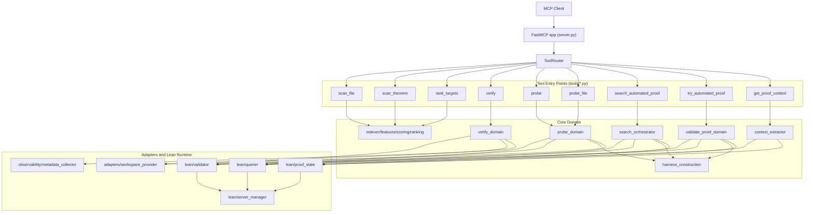
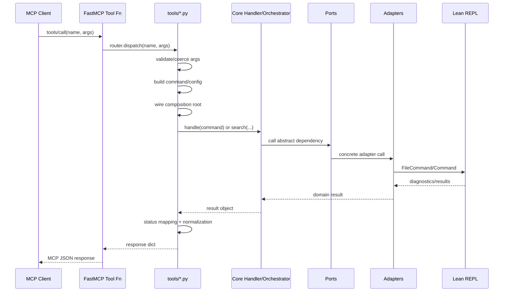
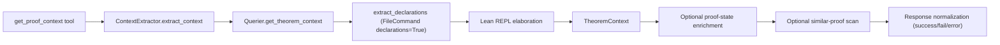

# System Overview

This document describes the current runtime architecture in `src/lean_proof_auto_mcp`
and aligns terminology with the implemented code paths.

## 1. Topology

## 2. Primary Runtime Pattern

This is the dominant runtime shape for stateful tools (`verify`, `probe`,
`probe_file`, `search_automated_proof`, `try_automated_proof`, `get_proof_context`).

## 3. Range-Based Harness Construction

### 3.1 Historical note

Harness construction evolved multiple times. Earlier generations relied on
string/line parsing of Lean declarations. The current implementation replaced
that approach with range-driven source splicing using Lean-provided declaration
value ranges.

### 3.2 Current implementation

Implemented in `core/harness_construction.py` as `RangeBasedHarnessConstructor`.
It is pure core logic: callers must provide source text and declarations.

### 3.3 Splicing algorithm

1. Resolve target theorem deterministically:
   - exact `full_name`
   - exact `name`
   - local-name fallback with explicit ambiguity checks
2. Classify target value-range shape (`assign`, `by`, `where`, `term_body`,
   `tactic_body`, `equation_clauses`, unsafe forms).
3. Classify proof attempt as tactic-mode or term-mode.
4. Build splice plan:
   - target declaration gets attempted proof replacement
   - non-target theorem/lemma declarations are replaced with `sorry`-safe forms
5. Enforce exactly one target splice.
6. Apply splices bottom-up (reverse order) so offsets remain valid.
7. Optionally inject extra imports (for example `import Aesop`).

### 3.4 Safety and replacement behavior

- Target declaration kinds allowed: `theorem`, `lemma`, `instance`.
- Non-target `sorry` replacements are restricted to safe kinds (`theorem`, `lemma`).
- Unsafe/empty range shapes fail fast for target declarations.
- Equation-clause non-target bodies are skipped instead of unsafe rewrites.

### 3.5 Failure modes

`HarnessError.error_type` values:

- `theorem_not_found`
- `ambiguous_theorem_id`
- `unsafe_target_range`
- `target_splice_cardinality`
- `invalid_proof_attempt`
- `construction_failed`

### 3.6 Harness execution flow

Probe-specific note: `probe` can inject `trace_config` options into generated
harness code before Lean execution (`set_option ...`), so harness execution can
include targeted Lean tracing when requested.

### 3.7 Why this replaced previous approaches

- Lean already exposes exact declaration/value ranges.
- Splicing by Lean ranges avoids reimplementing Lean syntax parsing.
- Error classification is clearer: construction failures are separated from
  Lean proof diagnostics.
- The approach is deterministic and easier to test with property/unit tests.

## 4. `get_proof_context` Architecture

### 4.1 Execution path

1. `tools/get_proof_context.py` validates args and builds composition root.
2. `ContextExtractor.extract_context(...)` orchestrates context assembly.
3. `LeanInteractQuerier.get_theorem_context(...)` loads declarations and
   returns theorem statement/proof/scope.
4. Optional `LeanInteractProofStateInspector` call enriches hypotheses.
5. Optional similar-proof search scans declarations and computes similarity.
6. Response is normalized into `status=success|fail|error`.

### 4.2 Performance profile

Dominant latency is usually Lean declaration extraction
(`FileCommand(..., declarations=True)`) on large Lean files. The querier keeps
an in-memory declarations cache per file path; repeated calls in the same
process may avoid re-running the expensive extraction.

### 4.3 Diagram

## 5. Shared runtime decisions reflected in code

- Lean server reuse is keyed by project root via
  `lean/server_manager.get_shared_server_manager`.
- Workspace auto-detection currently selects `none` mode in adapter logic.
- Tool API version is uniform across registered tools (`1.1.0`).
