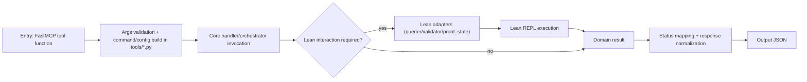
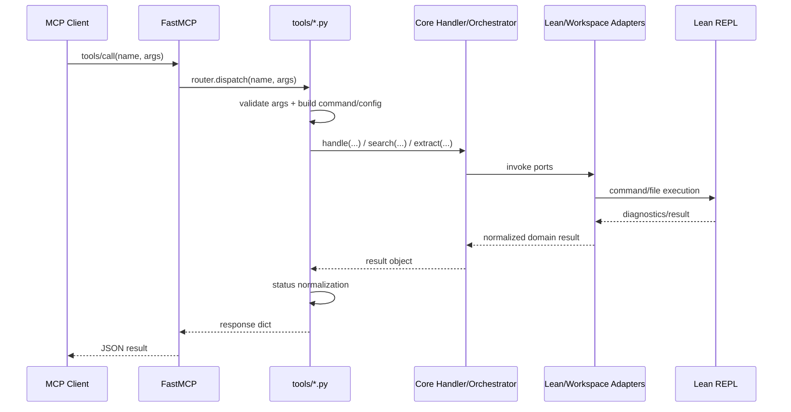

# MCP Tools Runtime

This section is the runtime hub for the MCP tool surface registered in
`src/lean_proof_auto_mcp/server.py`.

## Tool registry

| Tool | API Version | Detailed Page |
|---|---|---|
| `scan_file` | `1.1.0` | `docs/mcp/tools/scan_file.md` |
| `scan_theorem` | `1.1.0` | `docs/mcp/tools/scan_theorem.md` |
| `rank_targets` | `1.1.0` | `docs/mcp/tools/rank_targets.md` |
| `verify` | `1.1.0` | `docs/mcp/tools/verify.md` |
| `probe` | `1.1.0` | `docs/mcp/tools/probe.md` |
| `probe_file` | `1.1.0` | `docs/mcp/tools/probe_file.md` |
| `search_automated_proof` | `1.1.0` | `docs/mcp/tools/search_automated_proof.md` |
| `try_automated_proof` | `1.1.0` | `docs/mcp/tools/try_automated_proof.md` |
| `get_proof_context` | `1.1.0` | `docs/mcp/tools/get_proof_context.md` |

## Generic workflow (tool-agnostic)

## Primary runtime pattern

## Status set by tool

| Tool | Status values |
|---|---|
| `scan_file` | `success`, `fail` |
| `scan_theorem` | `success`, `fail` |
| `rank_targets` | `success`, `fail` |
| `verify` | `success`, `fail`, `timeout`, `error` |
| `probe` | `success`, `fail`, `timeout`, `error` |
| `probe_file` | `success`, `partial`, `error` |
| `search_automated_proof` | `success`, `partial`, `fail`, `error` |
| `try_automated_proof` | `success`, `rejected`, `incomplete`, `timeout`, `error` |
| `get_proof_context` | `success`, `fail`, `error` |

For semantics and request/response details, use the individual tool pages.
