# get_proof_context Tool

`get_proof_context` extracts theorem context for downstream reasoning, including statement, original proof text, scope, and optional similar proofs.

## Entrypoint and runtime path

- FastMCP entry: `server.py::get_proof_context_tool(...)`
- Tool function: `tools/get_proof_context.py::get_proof_context`
- Core service: `core/context_extractor.py::ContextExtractor`
- Lean adapters: `LeanInteractQuerier` and optional `LeanInteractProofStateInspector`

## Request fields

```json
{
  "file": "path/to/File.lean",
  "theorem_id": "Namespace.theoremName",
  "include_similar_proofs": true,
  "similarity_threshold": 0.7
}
```

- `file` and `theorem_id` are required.
- `include_similar_proofs` defaults to `true`.
- `similarity_threshold` must be a number in `[0.0, 1.0]`.

## Response highlights

- `api_version`: `1.1.0`
- `status`: `success | fail | error`
- `run_id`, `file`, `theorem_id`
- `theorem_statement`
- `original_proof` (normalized to strip leading `:=` when present)
- `hypotheses`, `in_scope`, `namespace`
- `similar_proofs[]` (when requested)
- `metadata`, `timing`

## Status semantics

| Status | Meaning | Trigger |
|---|---|---|
| `success` | context extracted | theorem context path succeeded |
| `fail` | expected non-success result | theorem not found / invalid target for context extraction |
| `error` | tool/runtime failure | input validation, file/runtime failure, internal exception |

## Workflow

```mermaid
flowchart LR
    A["MCP entry"] --> B["args validation + run_id"]
    B --> C["ContextExtractor.extract_context"]
    C --> D["Querier.get_theorem_context"]
    D --> E["Optional: proof-state hypothesis fallback"]
    E --> F["Optional: similar proof search + scoring"]
    F --> G["Normalize original_proof + format metadata"]
    G --> H["status normalization (success/fail/error)"]
    H --> I["response"]
```



