# probe Tool

`probe` runs one automation attempt (`aesop`, `aesop?`, or `grind`) against one theorem using a range-based harness.

## Entrypoint and runtime path

- FastMCP entry: `server.py::probe_tool(...)`
- Tool function: `tools/probe.py::probe`
- Core handler: `core/probe_domain.py::ProbeCommandHandler`
- Harness construction: `core/harness_construction.py::RangeBasedHarnessConstructor`
- Lean adapter: `lean/validator.py::LeanInteractProofValidator`

## Request fields

```json
{
  "file": "path/to/File.lean",
  "theorem_id": "Namespace.theoremName",
  "mode": "aesop",
  "budget_s": 30.0,
  "trace_config": null
}
```

- `file`, `theorem_id`, `mode` are required.
- `mode` must be one of `aesop | aesop? | grind`.
- `budget_s` must be a positive number.
- `trace_config` is optional and must be an object or `null`.

## Response highlights

- `api_version`: `1.1.0`
- `status`: `success | fail | timeout | error`
- `run_id`
- `probe_result` with `mode`, `outcome`, `classification`, `suggested_script`
- `diagnostics[]`, `timing`, `metadata`

`probe_result.outcome` is one of `closed | not_closed | timeout | error`.

## Status semantics

| Status | Meaning | Trigger |
|---|---|---|
| `success` | automation closed the theorem goal | handler outcome is `closed` |
| `fail` | tool ran, but theorem was not closed | handler outcome is `not_closed` or expected non-success path |
| `timeout` | budget exhausted | Lean timeout path |
| `error` | infrastructure/tool/runtime failure | input validation error, workspace/harness/runtime failure |

## Workflow

```mermaid
flowchart LR
    A["MCP entry"] --> B["args validation + ProbeCommand build"]
    B --> C["ProbeCommandHandler.handle"]
    C --> D["RangeBasedHarnessConstructor.construct"]
    D --> E["LeanInteractProofValidator.verify_file"]
    E --> F["Lean REPL execution"]
    F --> G["ProbeOutcome + classification"]
    G --> H["status normalization"]
    H --> I["response"]
```



