# probe_file Tool

`probe_file` runs batch probing across multiple theorems in one file, reusing a shared workspace and Lean server.

## Entrypoint and runtime path

- FastMCP entry: `server.py::probe_file_tool(...)`
- Tool function: `tools/probe_file.py::probe_file`
- Core handler: `core/probe_domain.py::ProbeFileCommandHandler`
- Delegates single-theorem execution to shared `ProbeCommandHandler` dependencies
- Uses `scan_file` and optional `rank_targets` for theorem enumeration/order

## Request fields

```json
{
  "file": "path/to/File.lean",
  "mode": "aesop",
  "budget_s_per": 30.0,
  "limit": 50,
  "ordering": "file_order"
}
```

- `file` and `mode` are required.
- `mode` must be `aesop | aesop? | grind`.
- `ordering` must be `file_order | rank_targets`.
- `budget_s_per` and `limit` must be positive.

## Response highlights

- `api_version`: `1.1.0`
- `status`: `success | partial | error`
- `file`
- `summary` with `total`, `closed`, `promising`, `failed`, `timed_out`
- `results[]` with `theorem_id`, `outcome`, `classification`, `elapsed_ms`
- `metadata` with elapsed time, counters, and optional `errors[]`

Notes:

- Only probeable declarations are included (`theorem`/`lemma`; `instance` and `example` are filtered out).
- In `partial` mode, successful theorem results are returned and per-theorem hard errors are reported in `metadata.errors`.

## Status semantics

| Status | Meaning | Trigger |
|---|---|---|
| `success` | batch completed without per-theorem hard errors | all selected theorems probed successfully |
| `partial` | mixed batch outcome | at least one theorem probe failed, at least one succeeded |
| `error` | batch-level failure | theorem enumeration, workspace, or runtime failed before usable results |

## Workflow

```mermaid
flowchart LR
    A["MCP entry"] --> B["args validation + ProbeFileCommand build"]
    B --> C["ProbeFileCommandHandler.handle"]
    C --> D["Enumerate theorems (scan_file; optional rank_targets ordering)"]
    D --> E["Create shared workspace + shared Lean server"]
    E --> F["For each theorem: range harness + Lean validate + classify"]
    F --> G["Aggregate summary + metadata"]
    G --> H["status normalization (success/partial/error)"]
    H --> I["response"]
```



