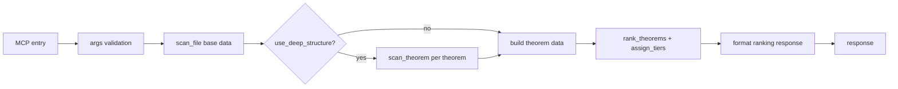

# rank_targets Tool

`rank_targets` ranks theorem candidates in a file using objective-driven scoring.

## Entrypoint and runtime path

- FastMCP entry: `server.py::rank_targets_tool(...)`
- Tool function: `tools/rank_targets.py::rank_targets`
- Uses `scan_file` (and optionally `scan_theorem`) then applies ranking/tiering.

## Request fields

```json
{
  "file": "path/to/File.lean",
  "objective": "balanced",
  "limit": 30,
  "include_components": true,
  "include_reasons": true,
  "use_deep_structure": false,
  "min_confidence": 0.0
}
```

`objective` is one of:
- `maximize_success`
- `maximize_impact`
- `maximize_subgoal_automation`
- `balanced`

## Response highlights

- `api_version`: `1.1.0`
- `status`: `success | fail`
- `tool`: `rank_targets`
- `ranking[]` with `score`, `tier`, optional `components`, optional `reasons`
- `summary` and `available_objectives`

## Status semantics

| Status | Meaning | Trigger |
|---|---|---|
| `success` | ranking completed | scan + ranking pipeline completed |
| `fail` | request/ranking failed | invalid objective/args or downstream analysis failure |

## Workflow


