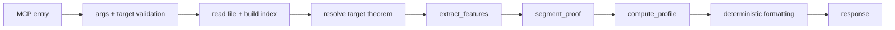

# scan_theorem Tool

`scan_theorem` performs targeted theorem analysis with structural segmentation
and automation scoring.

## Entrypoint and runtime path

- FastMCP entry: `server.py::scan_theorem_tool(file, target)`
- Tool function: `tools/scan_theorem.py::scan_theorem`
- Core pipeline: `indexer/find_by_id|find_by_range` -> `features` ->
  `segmenter` -> `scoring`

`scan_theorem` does not execute Lean REPL commands.

## Request fields

```json
{
  "file": "path/to/File.lean",
  "target": {
    "theorem_id": "Namespace.theoremName"
  }
}
```

`target` may also be a range:

```json
{
  "target": {
    "range": {
      "start_line": 10,
      "end_line": 30
    }
  }
}
```

## Response highlights

- `api_version`: `1.1.0`
- `status`: `success | fail`
- `tool`: `scan_theorem`
- `target` echo
- `theorem` object with `structure`, `automation`, `notes`

## Status semantics

| Status | Meaning | Trigger |
|---|---|---|
| `success` | analysis completed | theorem target resolved and analysis produced result |
| `fail` | request/analysis failed | invalid target args or analysis exception |

## Workflow


