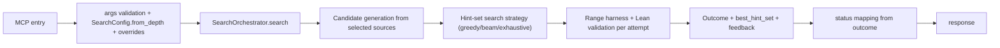

# search_automated_proof Tool

`search_automated_proof` performs orchestrated hint-set search to find an automated proof for a target theorem.

## Entrypoint and runtime path

- FastMCP entry: `server.py::search_automated_proof_tool(...)`
- Tool function: `tools/search_automated_proof.py::search_automated_proof`
- Core orchestrator: `core/search_orchestrator.py::SearchOrchestrator`
- Candidate generation: `core/candidate_generator.py::CandidateGenerator`
- Feedback formatting: `core/feedback_builder.py::FeedbackBuilder`
- Harness + Lean validation: range harness constructor + `LeanInteractProofValidator`

## Request fields

Core required fields:

```json
{
  "file": "path/to/File.lean",
  "theorem_id": "Namespace.theoremName",
  "search_depth": "normal"
}
```

Key controls:

- `search_depth`: `quick | normal | deep | exhaustive` (preset baseline)
- Search overrides: `search_budget_s`, `max_candidates`, `max_candidates_per_source`, `max_search_steps`
- Candidate controls: `candidate_sources`, `max_hints_in_set`, `allow_simp_hints`, `allow_unfold_hints`, `allow_unsafe_hints`
- Automation controls: `automation_mode`, `automation_secondary`, `search_strategy`, `beam_width`
- Output controls: `return_proof_states`, `return_partial_progress`, `return_context`, `return_similar_proofs`, `return_search_trace`

Supported `candidate_sources` values:

- `goal_symbols`
- `local_context`
- `same_namespace`
- `nearby_decls`
- `original_proof_refs`

## Response highlights

- `api_version`: `1.1.0`
- `status`: `success | partial | fail | error`
- `run_id`, `file`, `theorem_id`
- `outcome`: `closed | partial | failed`
- `best_hint_set`, `attempts`, `explored_sets`
- `feedback`, `metadata`, `search_trace`, `timing`

## Status semantics

| Status | Meaning | Trigger |
|---|---|---|
| `success` | search found a closing hint set | `outcome=closed` |
| `partial` | search made partial progress | `outcome=partial` |
| `fail` | search exhausted without closure | `outcome=failed` |
| `error` | tool/runtime failure | input validation, file/runtime error, internal exception |

## Workflow



