# try_automated_proof Tool

`try_automated_proof` validates a concrete proof attempt for one theorem and returns structured rejection or progress feedback.

## Entrypoint and runtime path

- FastMCP entry: `server.py::try_automated_proof_tool(...)`
- Tool function: `tools/try_automated_proof.py::try_automated_proof`
- Core handler: `core/validate_proof_domain.py::ValidateProofCommandHandler`
- Harness construction: `core/harness_construction.py::RangeBasedHarnessConstructor`
- Lean adapter: `lean/validator.py::LeanInteractProofValidator`
- Optional proof state enrichment: `lean/proof_state.py::LeanInteractProofStateInspector`

## Request fields

```json
{
  "file": "path/to/File.lean",
  "theorem_id": "Namespace.theoremName",
  "proof_attempt": "by aesop",
  "timeout_s": 10.0,
  "return_proof_state": true
}
```

- `file`, `theorem_id`, `proof_attempt` are required.
- `timeout_s` must be positive.
- `return_proof_state` must be boolean.

## Response highlights

- `api_version`: `1.1.0`
- `status`: `success | rejected | incomplete | timeout | error`
- `run_id`, `file`, `theorem_id`
- `validation_status` (domain result)
- `error_message`, `error_location`
- `proof_state` (when requested and available)
- `suggestions`, `metadata`, `timing`

## Status semantics

| Status | Meaning | Trigger |
|---|---|---|
| `success` | proof attempt accepted and goals closed | validator returned `success` |
| `rejected` | Lean rejected the proof attempt | validator returned `rejected` |
| `incomplete` | proof compiles but leaves goals | validator returned `incomplete` |
| `timeout` | validation budget exhausted | validator returned `timeout` |
| `error` | tool/runtime failure | input validation failure or internal/runtime exception |

## Workflow

```mermaid
flowchart LR
    A["MCP entry"] --> B["args validation + ValidateProofCommand build"]
    B --> C["ValidateProofCommandHandler.handle"]
    C --> D["Deterministic theorem matching in declarations"]
    D --> E["RangeBasedHarnessConstructor.construct"]
    E --> F["LeanInteractProofValidator.validate_harness_code"]
    F --> G["Optional proof-state enrichment for incomplete result"]
    G --> H["status/validation_status normalization"]
    H --> I["response"]
```



