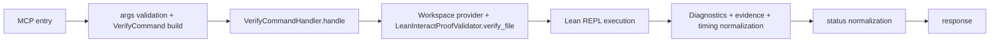

# verify Tool

`verify` is the foundational Lean execution tool. It checks a file-level scope
or theorem-targeted scope and returns normalized diagnostics.

## Entrypoint and core path

- Tool entry: `tools/verify.py`
- Core handler: `core/verify_domain.py` (`VerifyCommandHandler`)
- Lean adapter: `lean/validator.py` (`LeanInteractProofValidator`)

## Request fields

```json
{
  "file": "path/to/File.lean",
  "theorem_id": null,
  "budget_s": 30.0,
  "max_log_excerpt_chars": 2000,
  "store_full_logs": true,
  "workspace_mode": null
}
```

Notes:

- `file` is required.
- `theorem_id` is optional.
- `workspace_mode` is validated by the tool interface but current composition
  root uses provider auto-detection (currently `none` mode).

## Response shape (high level)

```json
{
  "api_version": "1.1.0",
  "status": "success | fail | timeout | error",
  "run_id": "...",
  "file": "...",
  "theorem_id": "...",
  "verification_scope_used": "file | theorem | file_fallback | none",
  "diagnostics": [],
  "diagnostic_summary": {},
  "evidence": {},
  "metadata": {},
  "timing": {}
}
```

## Status semantics

| Status | Meaning | Trigger |
|---|---|---|
| `success` | Verification passed | Lean finished and no error-severity diagnostics remain |
| `fail` | Verification completed with Lean errors | Lean run completed but diagnostics include errors |
| `timeout` | Time budget exceeded | Lean timed out for the requested budget |
| `error` | Tool/runtime failure | Input validation failure, Lean runtime failure, or internal exception |

## Workflow



## Runtime notes

- `run_id` is unique per invocation and includes timestamp/hash/random suffix.
- Diagnostics are normalized and deterministically sorted in the handler.
- Optional artifact persistence writes request/result/logs via
  `FilesystemArtifactStore`.
