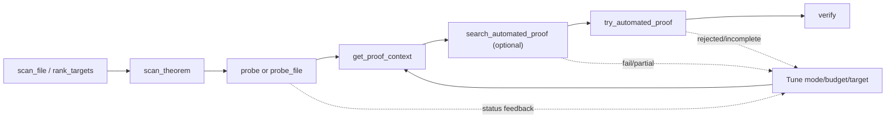

# Interactive User Flow

This flow reflects the current toolchain behavior and status normalization.

## Step-by-step workflow

1. Discover targets in a file.
   - Call `scan_file` to enumerate declarations and baseline automation signals.
   - Optional: call `rank_targets` to prioritize targets by objective.
2. Inspect one theorem deeply.
   - Call `scan_theorem` for structure-level details.
3. Measure baseline automation.
   - Call `probe` for one theorem or `probe_file` for a batch.
   - Use classifications (`trivial`, `promising`, `failed`, `timed_out`) to decide next action.
4. Pull context for guided iteration.
   - Call `get_proof_context` for statement, original proof, scope, and optional similar proofs.
5. Run bounded automated search (optional).
   - Call `search_automated_proof` with depth/strategy controls.
6. Validate candidate proof directly.
   - Call `try_automated_proof` with `proof_attempt`.
   - This path uses range-based harness construction and Lean validation.
7. Final verification.
   - Call `verify` on theorem/file scope for final pass/fail signal.

## Status and result handling

- Treat `success` as terminal positive outcome.
- Treat `fail` as expected negative outcome (not infrastructure failure).
- Treat `partial` as usable progress requiring follow-up.
- Treat `timeout` as budget issue (retry with larger budget or narrower scope).
- Treat `error` as tool/runtime failure requiring input/runtime investigation.
- For `try_automated_proof`, distinguish `rejected` (proof wrong) from `error`
  (tool/runtime issue).

## Harness usage in interactive flow

- Harness-backed tools: `probe`, `probe_file`, `search_automated_proof`,
  `try_automated_proof`.
- Current harness strategy: range-based source splicing (`RangeBasedHarnessConstructor`).
- `verify` and static analysis tools do not build range-spliced harnesses.

## Flow diagram

